# 🚀 Projectra – Project Management App

**Projectra** is a comprehensive project management application designed to help you manage your projects more efficiently. With powerful collaboration features, team management, and robust tracking capabilities, Projectra is your all-in-one solution for project success.

---

## ✨ Features

- ✅ **Project Management**: Create, manage, and track multiple projects with ease.
- 👥 **Team Collaboration**: Seamlessly work together with your team, assign tasks, and monitor progress.
- 🌐 **Community Building**: Foster connections and networking within your workspace.
- ⏱️ **Time Tracking**: Keep track of work hours and project deadlines to ensure timely delivery.

---

## 🎯 Benefits

- 📈 Increased productivity and accountability.
- 🗣️ Improved team communication and collaboration.
- 🎯 Better project outcomes through streamlined workflows.
- 🤝 Opportunities for networking and community engagement.

---

## ⚙️ Technologies Used

- **React.js** – Modern frontend framework for a dynamic and responsive UI.
- **Node.js** – Backend runtime environment.
- **Express.js** – Web framework for RESTful APIs.
- **MongoDB** – NoSQL database for storing project and user data.
- **Styled Components** – For component-level styling.
- **Material-UI** – Modern and responsive UI components.
- **Nodemailer** – For sending emails and notifications.

---

## 📸 Screenshots

Here's a visual preview of Projectra's core screens and features:

### 🔹 Landing Page


### 🔹 Dashboard
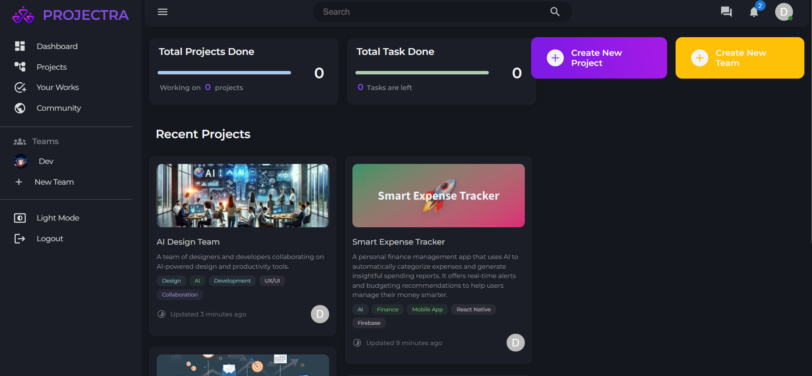

### 🔹 Projects
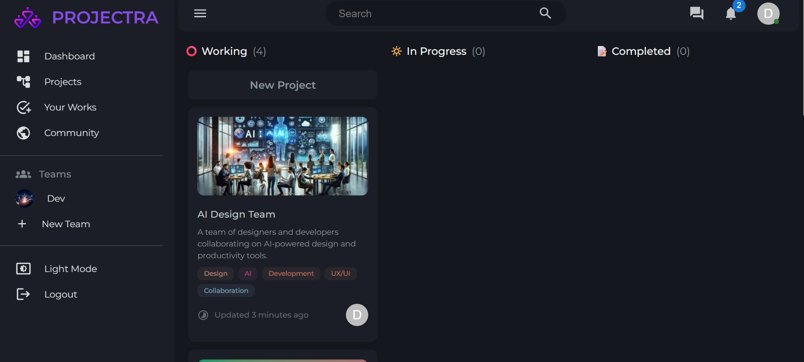
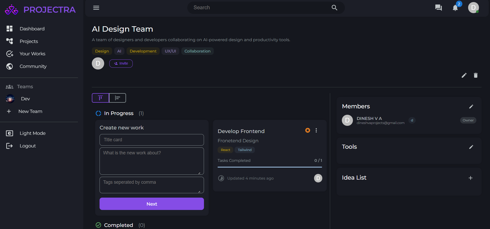

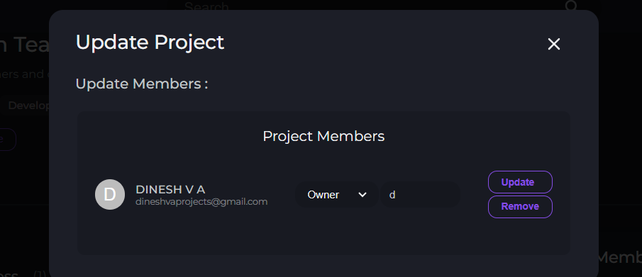

### 🔹 Create Project


### 🔹 Join Project


### 🔹 Teams
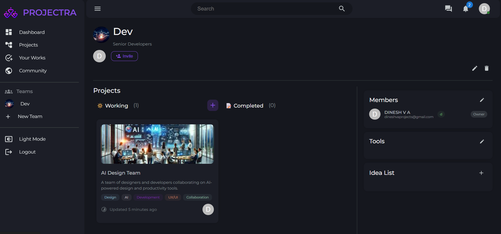

### 🔹 Create Team


### 🔹 Join Team


### 🔹 Chat
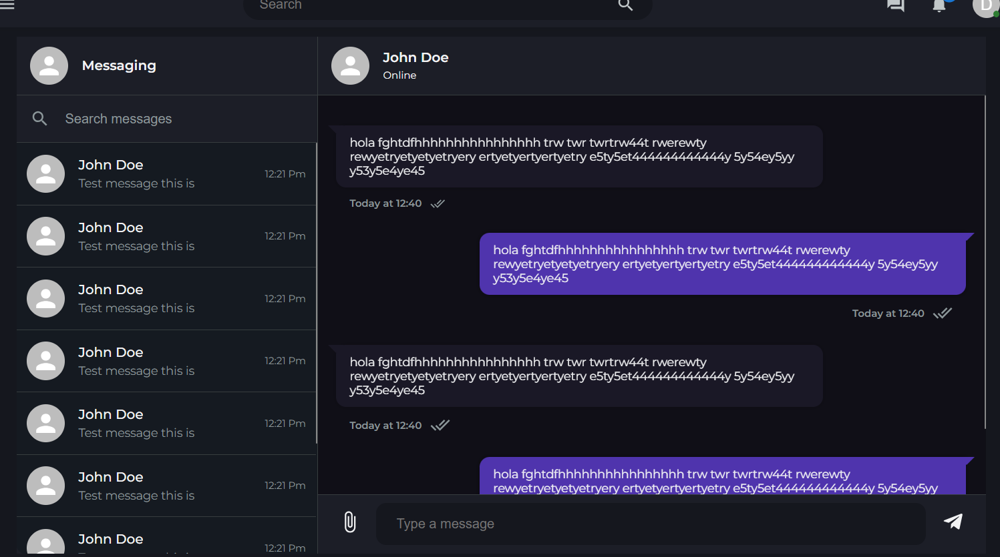

### 🔹 Notifications
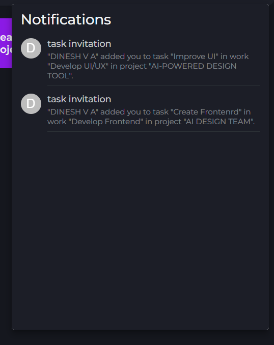

### 🔹 Tools
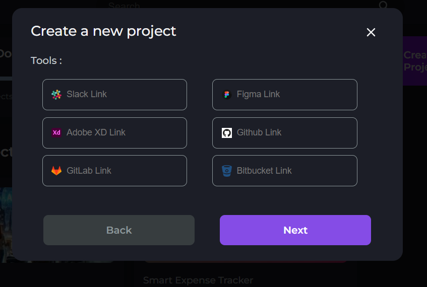

### 🔹 Works
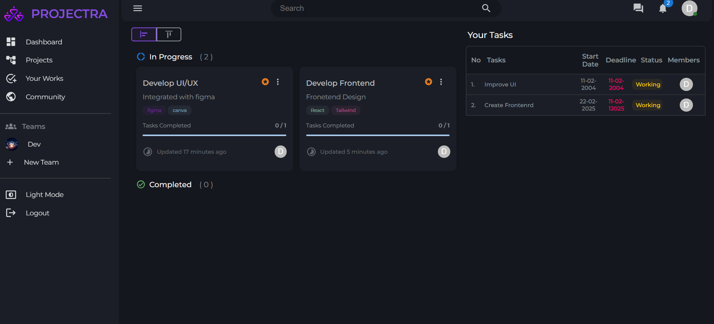

### 🔹 Authentication
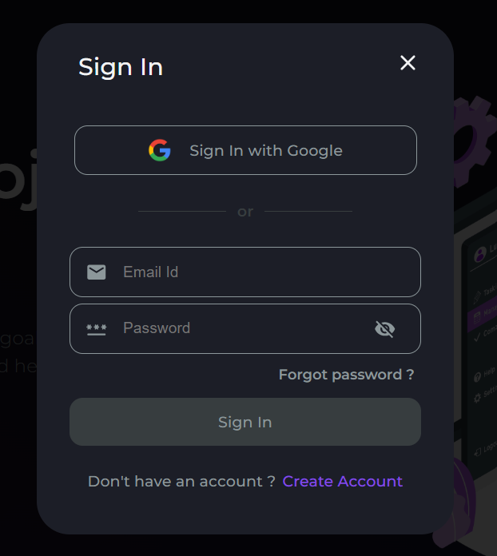
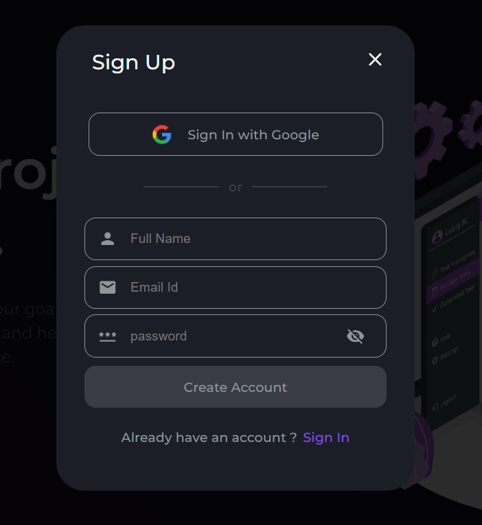

---

## 🛠️ Getting Started

Follow these steps to set up Projectra locally:

### 1️⃣ Prerequisites

Ensure you have:
- **Node.js** and **npm** installed.
- **MongoDB** (local or MongoDB Atlas).
- **Git** for version control.

### 2️⃣ Installation

```bash
# Clone the repository
git clone https://github.com/v-a-dinesh/Projectra.git

# Navigate to the project directory
cd Projectra

# Install dependencies
npm install
```

### 3️⃣ Start the Application

**Start the Frontend**
```bash
cd client
npm start
```

**Start the Backend**
```bash
cd server
npm start
```

The frontend will run at `http://localhost:3000` and the backend at `http://localhost:5000`.

---

## 🔍 Testing the Application

- Access the application at `http://localhost:3000`.
- Test features like project creation, team joining, notifications, and chat.
- Verify database operations and user management.
- Test responsiveness across different devices.

---

## 🌟 Contribution

We welcome contributions! Please feel free to:

1. Fork the repo.
2. Create a feature branch.
3. Submit a pull request with your changes.

---

## 📞 Support

If you encounter issues, please open an issue in the GitHub repository or contact the maintainer.

---

## 🔗 Repository

Visit the project repository: [https://github.com/v-a-dinesh/Projectra](https://github.com/v-a-dinesh/Projectra)

---

## 🎉 Thank you for checking out Projectra! Let's build amazing projects together!